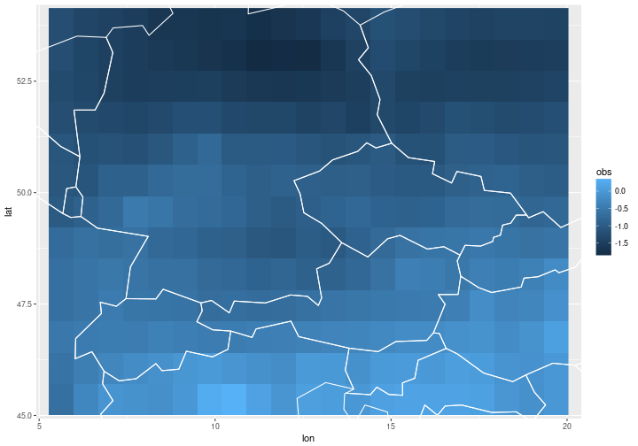
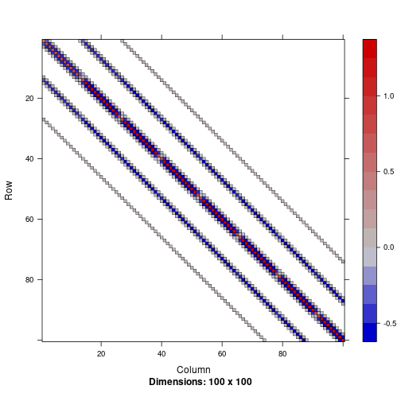
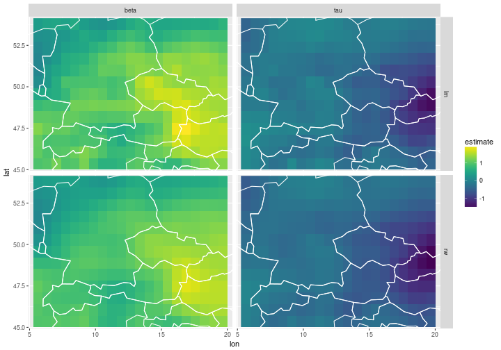

```r
suppressPackageStartupMessages(library(rnaturalearth))
suppressPackageStartupMessages(library(maps))
suppressPackageStartupMessages(library(tidyverse))
suppressPackageStartupMessages(library(Matrix))
suppressPackageStartupMessages(library(viridis))
knitr::opts_chunk$set(
  cache.path='_knitr_cache/grid-regression/',
  fig.path='figure/grid-regression/'
)
```

# The data

Our data consists of climate model forecasts and corresponding observations of surface temperature over a region in central Europe in summer (June-August).
There are 17 years' worth of forecasts and observations (1993-2009) with one forecast per year. 
The climate model forecast were initialised in early May of the same year.
The forecast and observation data were normalised to have mean zero and variance one.


```r
load('data/grid-regression.Rdata') # available in the repository

# grid parameters
N_i = t2m %>% distinct(lat) %>% nrow
N_j = t2m %>% distinct(lon) %>% nrow
N_t = t2m %>% distinct(year) %>% nrow
S   = N_i * N_j

# lat/lon range
lat_range = t2m %>% select(lat) %>% range
lon_range = t2m %>% select(lon) %>% range

# prepare the temperature data frame
t2m = t2m %>% 
  spread('type', 'temp') %>%
  mutate(i = as.numeric(factor(lat, labels=1:N_i))) %>%
  mutate(j = as.numeric(factor(lon, labels=1:N_j))) %>%
  mutate(s = (j-1) * N_i + i)

t2m
```

```
## # A tibble: 4,641 x 8
##     year   lat   lon       fcst         obs     i     j     s
##    <int> <dbl> <dbl>      <dbl>       <dbl> <dbl> <dbl> <dbl>
##  1     1 45.35  5.62 -0.5723529 -0.65581699     1     1     1
##  2     1 45.35  6.33 -0.5403007 -0.28856209     1     2    14
##  3     1 45.35  7.03 -0.4745686 -0.08392157     1     3    27
##  4     1 45.35  7.73 -0.5454510 -0.12503268     1     4    40
##  5     1 45.35  8.44 -0.6720850 -0.16267974     1     5    53
##  6     1 45.35  9.14 -0.6268562 -0.03320261     1     6    66
##  7     1 45.35  9.84 -0.5265686  0.27477124     1     7    79
##  8     1 45.35 10.55 -0.5040850  0.35745098     1     8    92
##  9     1 45.35 11.25 -0.4779935  0.11647059     1     9   105
## 10     1 45.35 11.95 -0.4878824 -0.06941176     1    10   118
## # ... with 4,631 more rows
```

Below we plot the observations at year one for illustration.


```r
borders = ne_countries(scale=110, continent='Europe') %>% map_data 
ggplot(t2m %>% filter(year==1)) + geom_raster(aes(x=lon, y=lat, fill=obs)) +
  coord_cartesian(xlim = lon_range, ylim=lat_range) +
  geom_path(data=borders, aes(x=long, y=lat, group=group), col='white')
```




# Linear regression on a grid

We have data on a grid with spatial gridpoints $(i,j)$, with row indices $i=1,...,N_i$ and column indices $j=1,...,N_j$.
For mathematical treatment, data on 2-d grids are collapsed into 1-d vectors by stacking the grid columns, so that the grid point with coordinates $i,j$ corresponds to the vector element $s = (j-1)N_i + i$.

At each grid point and each time $t=1,...,N_t$ we have an observable $y_{s,t}$ and a covariate $f_{s,t}$ which are related by a linear relationship plus random errors:

\begin{equation}
y_{s,t} = \alpha_s + \beta_s f_{s,t} + \sqrt{e^{\tau_s}} \epsilon_{s,t}
\end{equation}

Specifically for our application we have

- $y_{s,t}$ is the observation of real climate at grid point $s$ at time $t$
- $f_{s,t}$ is the (imperfect) climate forecast for gridpoint $s$ for time $t$ that is corrected ("post-processed") by linear regression
- $\alpha_s$, $\beta_s$ and $\tau_s$ are parameters of the regression model that are assumed to be constant in time but variable in space
- the residuals $\epsilon_{s,t}$ are iid standard Normal variates


Our goal is to model the regression parameters $\alpha_s$, $\beta_s$ and $\tau_s$ as being spatially smooth so that the linear regression model at point $(i,j)$ can benefit from data at neighboring grid points.
We should hope that the resulting reduction in estimator variance improves the overall performance of the model.


For spatial modelling, we collect the regression parameters in the vector $x = (\alpha_1, ..., \alpha_{N_s}, \beta_1, ..., \beta_{N_s}, \tau_1, ..., \tau_{N_s})$, which will be called the _latent field_.

The joint log-likelihood of the observations, given the latent field $x$ and any hyperparameters $\theta$ is proportional to

\begin{align}
\log p(y_{1,1},...y_{N_t,{N_s}} \vert x,\theta) & = \sum_{s,t} \log p(y_{s,t} \vert x,\theta)\newline
& \propto -\frac{N_t}{2} \sum_s \tau_s - \frac12 \sum_{s=1}^{N_s} \sum_{t=1}^{N_t} e^{-\tau_s} (y_{s,t} - \alpha_s - \beta_s f_{s,t})^2
\end{align}

The latent field $x$ is assumed to be a Gauss-Markov random field (GMRF), i.e. $x$ has a multivariate Normal distribution with zero mean vector and sparse precision matrix $Q$.
We assume that the three sub-vectors of $x$, i.e. $\alpha$, $\beta$ and $\tau$, are independent, and that the precision matrices that characterise their spatial structure are $Q_\alpha$, $Q_\beta$ and $Q_\tau$. 
The latent field $x$ thus has distribution

\begin{align}
\log p(x \vert \theta) & = \log p(\alpha \vert \theta) + \log p(\beta \vert \theta) + \log p(\tau \vert \theta)\newline
& \propto \frac12 (\log\det Q_\alpha + \log\det Q_\beta + \log\det Q_\tau) - \frac12 \left[ \alpha' Q_\alpha \alpha + \beta' Q_\beta \beta  + \tau' Q_\tau \tau \right]\newline
& =: \frac12 \log\det Q - \frac12 x'Qx
\end{align}

and $x$ is a GMRF with precision matrix given by the block-diagonal matrix $(Q_\alpha, Q_\beta, Q_\tau)$. 

The precision matrix will be determined below.
For the moment we will fix any hyperparameters $\theta$ at known values, so no prior $p(\theta)$ has to be specified.


## Spatial dependency

To model spatial dependency of the regression parameters, we will use a 2d random walk model, i.e. the value at grid point $(i,j)$ is given by the average of its neighbors plus independent Gaussian noise with constant variance $\sigma^2$:

\begin{equation}
x_{i,j} \sim N\left[\frac14 (x_{i-1,j} + x_{i+1,j} + x_{i,j-1} + x_{i,j+1}), \sigma^2 \right]
\end{equation}


**TODO:** derive matrix $D$ for this model as in Rue and Held (2005), then $Q=D'D$, discuss free boundary conditions and zero eigenvalues


```r
# diagonals of the circular matrix D
diags = list(rep(1,S), 
             rep(-.25, S-1),
             rep(-.25, (N_j-1)*N_i))

# missing values outside the boundary are set equal to the value on the
# boundary, i.e. values on the edges have 1/4 of themselves subtracted and
# values on the corners have 1/2 of themselves subtracted
edges = sort(unique(c(1:N_i, seq(N_i, S, N_i), seq(N_i+1, S, N_i), (S-N_i+1):S)))
corners = c(1, N_i, S-N_i+1, S)
diags[[1]][edges] = 0.75 
diags[[1]][corners] = 0.5 
# values on first and last row have zero contribution from i-1 and i+1
diags[[2]][seq(N_i, S-1, N_i)] = 0 

# construct band matrix D and calculate Q
Dmat = bandSparse(n = S, k=c(0,1,N_i), diagonals=diags, symmetric=TRUE)
Q_alpha = Q_beta = Q_tau = crossprod(Dmat)
```

Below we plot a part of the precision matrix $Q$ to illustrate its structure and highlight its sparsity:


```r
image(Q_alpha[1:100, 1:100])
```




## Approximating $p(x \vert y)$ by the Laplace approximation

We want to calculate the posterior distribution of the regression parameters collected in the field $x$, given the observed data $y$.
To this end we have to normalise the joint distribution $p(y,x)$ with respect to $x$, i.e. we have to calculate the integral of $p(y,x)$ with respect to $x$, where $p(y,x)$ is given by


\begin{align}
\log p(y,x) & \propto \log p(y \vert x) + \log p(x)\newline
& \propto -\frac{N_t}{2} \sum_s \tau_s - \frac12 \sum_{s=1}^{N_s} \sum_{t=1}^{N_t} e^{-\tau_s} (y_{s,t} - \alpha_s - \beta_s f_{s,t})^2 + \frac12 \log\det Q - \frac12 x'Qx
\end{align}

Define the function $f(x)$ as proportional to $\log p(y,x)$ at fixed values of $y$ and any hyperparameters $\theta$:

\begin{equation}
f(x) = - \frac12 x'Qx - \frac{N_t}{2} \sum_s \tau_s - \frac12 \sum_{s=1}^{N_s} \sum_{t=1}^{N_t} e^{-\tau_s} (y_{s,t} - \alpha_s - \beta_s f_{s,t})^2 
\end{equation}

The conditional distribution $p(x \vert y)$ is given by

\begin{equation}
p(x \vert y, \theta) = \frac{e^{f(x)}}{\int dx'\; e^{f(x')}}
\end{equation}


**Laplace approximation**: $p(x\vert y)$ is a Gaussian with mean equal to the mode of $f(x)$ and precision matrix given by the negative Hessian of $f(x)$ at the mode. 


**TODO**: Taylor approximation of $f(x)$, more on the Laplace approximation

The function `calc_f` below returns a list with the value of $f$, the gradient $grad f$ and the Hessian matrix $Hf$ at a given value of $x$:


```r
calc_f = function(x, sigma2, data) {
# function that returns a list of f, grad f, hess f as function of sigma2 (the
# innovation variance of the 2d random walk)
# data is a data frame with columns: s, year, obs, fcst

  S = data %>% distinct(s) %>% nrow
  N_t = data %>% distinct(year) %>% nrow

  alpha = x[1:S]
  beta = x[1:S + S]
  tau = x[1:S + 2*S]
  df_x = data_frame(s = 1:S, alpha=alpha, beta=beta, tau=tau)
  df = data %>%
    # join alpha, beta, tau to data frame
    left_join(df_x, by='s') %>%
    # add fitted values and residuals
    mutate(yhat = alpha + beta * fcst,
           resid = obs - yhat) %>%
    # calculate the necessary summary measures for gradient and hessian
    group_by(s) %>% 
    summarise(
      tau         = tau[1],
      exp_m_tau   = exp(-tau),
      sum_resid   = sum(resid),
      sum_resid_2 = sum(resid ^ 2),
      sum_f_resid = sum(fcst * resid),
      sum_f_2     = sum(fcst ^ 2),
      sum_f       = sum(fcst))
  

  derivs = df %>% mutate(
             dgda   = exp_m_tau * sum_resid,
             dgdb   = exp_m_tau * sum_f_resid,
             dgdt   = -N_t/2 + 0.5 * exp_m_tau * sum_resid_2,
             d2gdaa = -N_t * exp_m_tau,
             d2gdbb = -exp_m_tau * sum_f_2,
             d2gdtt = -0.5 * exp_m_tau * sum_resid_2,
             d2gdab = -exp_m_tau * sum_f,
             d2gdat = -exp_m_tau * sum_resid,
             d2gdbt = -exp_m_tau * sum_f_resid) %>%
           arrange(s)

  # calculate f(x)
  f = with(df, -N_t/2 * sum(tau) - 0.5 * sum(exp_m_tau * sum_resid_2)) -
        0.5 * drop(crossprod(alpha, Q_alpha) %*% alpha + 
                   crossprod(beta,  Q_beta)  %*% beta  + 
                   crossprod(tau,   Q_tau)   %*% tau) / sigma2

  # the gradient
  grad_f = c(-drop(Q_alpha %*% alpha) / sigma2 + derivs$dgda,
             -drop(Q_beta  %*% beta)  / sigma2 + derivs$dgdb,
             -drop(Q_tau   %*% tau)   / sigma2 + derivs$dgdt)

  # the hessian
  hess_f = 
    - bdiag(Q_alpha, Q_beta, Q_tau) / sigma2 + 
    with(derivs, bandSparse(
      n = 3 * S, 
      k = c(0, S, 2 * S), 
      diagonals= list(c(d2gdaa, d2gdbb, d2gdtt), c(d2gdab, d2gdbt), d2gdat), 
      symmetric=TRUE))
  
  return(list(f=f, grad_f=grad_f, hess_f=hess_f))
           
}
```


The function `calc_x0` uses the derivatives returned by `calc_f` to iteratively find the mode of $f(x)$, and thus the mode of $p(x \vert y, \theta)$:


```r
calc_x0 = function(sigma2, data, lambda=1, tol=1e-4) {
  S = data %>% distinct(s) %>% nrow
  x0 = rep(0, 3*S) # initial guess is x0 = 0
  converged = FALSE
  while(!converged) {
    f_list = calc_f(x0, sigma2, data)
    #
    # relaxed Newton's method: decrease step size
    # x = x0 + lambda * with(f_list, solve(hess_f, - grad_f))
    #
    # Levenberg-Marquardt method: increase the diagonal of Hf to improve
    # conditioning 
    f_list = within(f_list, {diag(hess_f) = diag(hess_f) * (1 + lambda)})
    x = x0 + with(f_list, solve(hess_f, - grad_f))
    if (mean((x-x0)^2) < tol) {
      converged = TRUE
    } else {
      x0 = x
    }
  }
  return(list(x0=x, Hf=f_list$hess_f))
}
```


Next we estimate the "most likely" configuration of the latent field $x$, i.e. the mode of $p(x \vert y, \theta)$, and rearrange the result 


```r
# estimate the model with smoothing parameter sigma2 = 0.1
x0_list = calc_x0(sigma2=0.1, data=t2m, lambda=1, tol=1e-4)

# extract mode and marginal stdev of the Laplace approximation
x0 = x0_list$x0
x0_sd = with(x0_list, sqrt(diag(solve(-Hf))))

# extract alpha, beta, tau 
df_x0 = data_frame(
  s = 1:S,
  alpha_hat = x0[1:S]      , alpha_hat_sd = x0_sd[1:S],
  beta_hat  = x0[1:S + S]  , beta_hat_sd  = x0_sd[1:S + S],
  tau_hat   = x0[1:S + 2*S], tau_hat_sd   = x0_sd[1:S + 2*S]
)

# combine with temperature 
df_out = t2m %>% 
  left_join(df_x0, by='s') %>%
  mutate(y_hat = alpha_hat + beta_hat * fcst) %>%
  mutate(resid_hat = obs - y_hat) %>%
  mutate(resid = obs - fcst)
```


## Linear regression without spatial dependency

For comparison, we also fit a linear regression model to each grid point individually without looking at the data at neighboring grid points.
We simply use `lm` to do this:


```r
t2m_lm = t2m %>% nest(-c(s,lat,lon)) %>%
  mutate(fit = purrr::map(data, ~ lm(obs ~ fcst, data=.)))

t2m_lm_coefs = t2m_lm %>%
  mutate(alpha_hat = map_dbl(fit, ~ .$coefficients[1]),
         beta_hat  = map_dbl(fit, ~ .$coefficients[2]),
         sigma2_hat = map_dbl(fit, ~ sum(.$residuals^2) / .$df.residual)) %>%
  select(-data, -fit)


t2m_lm_fit = 
  t2m_lm %>%
  mutate(fit = purrr::map(fit, fortify)) %>%
  unnest(fit, data) %>%
  select(-c(.sigma, .cooksd, .stdresid)) %>%
  mutate(resid_loo = .resid / (1 - .hat)) %>%
  rename(resid = .resid, fitted=.fitted) 

# calculate mse summary measures
t2m_lm_mse =
  t2m_lm_fit %>% group_by(s,lat,lon) %>%
  summarise(mse = mean(resid^2),
            mse_loo = mean(resid_loo^2)) %>%
  semi_join(select(t2m_lm_fit, s,lat,lon), by='s')
```


## Compare fitted parameters


```r
# extract parameter estimates from spatial model
df_pars_rw = df_out %>% filter(year==1) %>% 
  select(lat, lon, s, alpha_hat, beta_hat, tau_hat) %>% 
  rename(alpha = alpha_hat, beta = beta_hat, tau = tau_hat) %>% 
  mutate(type='rw')
# extract parameter estimates from independent model
df_pars_lm = t2m_lm_coefs %>% 
  rename(alpha=alpha_hat, beta=beta_hat, sigma2 = sigma2_hat) %>%
  mutate(tau = log(sigma2)) %>% select(-sigma2) %>%
  mutate(type='lm')
# combine into one data frame, ignore alpha since it is zero for normalised
# data
df_pars = bind_rows(df_pars_lm, df_pars_rw) %>% 
  select(-alpha) %>%
  gather('parameter', 'estimate', c(beta, tau))
```

We plot the estimated regression parameters $\beta$ and $\tau$ on the grid for the independent model (top) and the spatially dependent 2d random walk model (bottom):


```r
ggplot(df_pars) + 
  geom_raster(aes(x=lon, y=lat, fill=estimate)) + 
  facet_grid(type~parameter) +
  geom_path(data=borders, aes(x=long, y=lat, group=group), col='white') +
  coord_cartesian(xlim = range(t2m$lon), ylim=range(t2m$lat)) +
  scale_fill_viridis() 
```



The smoothing of the regression parameters worked successfully.
The estimated parameters are similar, but the field on the bottom is smoother because we have built spatial dependency into the model.
By varying the parameter `sigma2` in the function `calc_x0` higher or lower degrees of smoothing can be achieved.

**TODO**: illustrate effect of different smoothing parameters


## In-sample evaluation

The important question is now whether the spatial smoothing has improved the post-processed forecasts or not.
First of all we look at the mean squared residuals of the two models, i.e. the mean squared prediction errors (MSEs) calculated on the training data:


```r
df_mse_insample_lm = t2m_lm_mse %>% select(-mse_loo) %>% mutate(type='lm')
df_mse_insample_rw = df_out %>% group_by(s,lat,lon) %>% summarise(mse = mean(resid^2)) %>% mutate(type='rw')
df_mse_insample = bind_rows(df_mse_insample_lm, df_mse_insample_rw)

df_mse_insample %>% group_by(type) %>% summarise(mse = mean(mse)) %>% knitr::kable()
```


|type |       mse|
|:----|---------:|
|lm   | 0.6612585|
|rw   | 0.6783852|

It is not surprising that the _in-sample_ residuals are smaller for the independent model than for the spatially dependent model, since sum of squared residuals is exactly the quantity that is minimised by standard linear regression.
Any modification will necessarily increase the sum of squared residuals.
To evaluate the models, we will have to look at their performances _out-of-sample_, i.e. how well they predict values of $y$ that were not part of the training data.


## Out-of-sample evaluation


```r
df_cv = t2m %>% mutate(y_hat = NA_real_)
for (yr_loo in unlist(distinct(t2m, year))) {

  # create training data set 
  df_trai = t2m %>% filter(year != yr_loo)

  # estimate regression parameters
  x0 = calc_x0(sigma2=0.1, data=df_trai, lambda=1, tol=1e-4)$x0
  alpha_hat = x0[1:S]
  beta_hat  = x0[1:S + S]
  tau_hat   = x0[1:S + 2*S]

  # append fitted value to data frame
  df_cv = df_cv %>% 
    mutate(y_hat = ifelse(year == yr_loo, alpha_hat + beta_hat * fcst, y_hat))
}
```


```r
df_mse_outofsample_lm = t2m_lm_fit %>% select(s, lat, lon, year, resid_loo) %>% mutate(type='lm')
df_mse_outofsample_rw = df_cv %>% mutate(resid_loo = y_hat - obs) %>% select(s, lat, lon, year, resid_loo) %>% mutate(type='rw')
df_mse_outofsample = 
  bind_rows(df_mse_outofsample_lm, df_mse_outofsample_rw) %>%
  group_by(type) %>% summarise(mse = mean(resid_loo^2))

df_mse_outofsample %>% knitr::kable()
```


|type |       mse|
|:----|---------:|
|lm   | 0.8995776|
|rw   | 0.8524261|

When evaluated out-of-sample in a leave-one-out cross validation, the regression model with smoothed parameters performs better than the regression model with independently fitted paramters.
The improvement in mean squared error is close to $10\%$, which is substantial.

This is encouraging. 
Since we have not yet optimised (or integrated over) the smoothing parameter $\sigma^2$ of the 2d random walk model further improvements might be possible.


