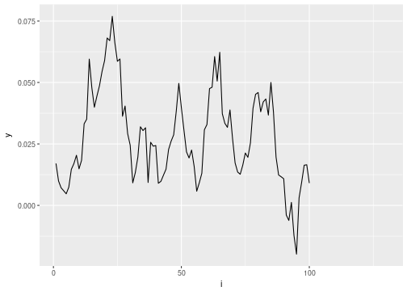
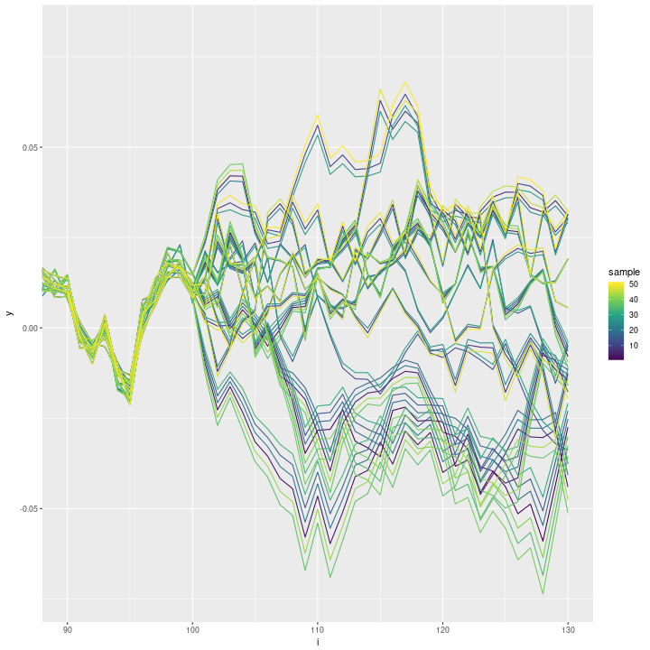
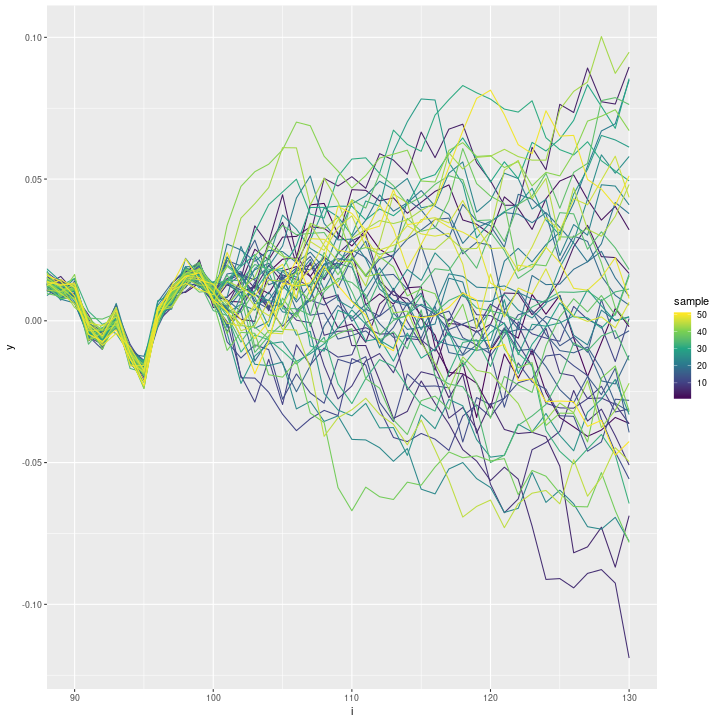

```r
suppressPackageStartupMessages(library(INLA))
suppressPackageStartupMessages(library(stringr))
suppressPackageStartupMessages(library(tidyverse))
knitr::opts_chunk$set(
  cache.path='_knitr_cache/sampler-problem/',
  fig.path='figure/sampler-problem/'
)
```

## Predicting a random walk

This example is to illustrate a problem with the posterior predictive sampling algorithm in R-INLA.


```r
set.seed(321)
n = 130

inla_data = data_frame(i = 1:n, y = cumsum(rnorm(n, 0, .01))) %>% 
              mutate(y = ifelse(i <= 100, y, NA_real_))

ggplot(data=inla_data, aes(x=i, y=y)) + geom_line()
```

```
## Warning: Removed 30 rows containing missing values (geom_path).
```




```r
# run inla 
inla_formula = y ~ f(i, model='rw1')
inla_result = inla(formula=inla_formula, data=inla_data, family='gaussian', 
              control.family=list(initial=12, fixed=TRUE),
              control.compute=list(config=TRUE))

# posterior predictive samples
n_sampls = 50
set.seed(321)
inla_sampls = inla.posterior.sample(n=n_sampls, result=inla_result, seed=123) 

# extract "Predictor" output
i_pred = str_c('Predictor:', str_pad(1:n, 3, 'left', '0'))
inla_sampls = inla_sampls %>% 
  setNames(1:n_sampls) %>%
  map_df( ~ .x$latent[i_pred,1]) %>%
  mutate(i = 1:n) %>%
  gather(key='sample', value='y', -i) %>%
  mutate_if(is.character, as.integer)

# plot predictive samples
ggplot(data=inla_sampls, aes(x=i, y=y, group=sample)) + geom_line(aes(colour=sample)) +
  scale_colour_continuous(type='viridis') + coord_cartesian(xlim=c(90, n))
```



The predictive samples are highly correlated. 
A lot of thinning will be necessary to get pseudo-independent samples.
I am wondering if there are options I could set to improve the sampler? 


## Avoiding the `seed` argument in `inla.posterior.sample`

The near-perfect correlation of the posterior predictive samples seems to disappear when I remove the `seed` argument in `inla.posterior.sample`:


```r
# posterior predictive samples
n_sampls = 50
set.seed(321)
inla_sampls_noseed = inla.posterior.sample(n=n_sampls, result=inla_result) 

# extract "Predictor" output
i_pred = str_c('Predictor:', str_pad(1:n, 3, 'left', '0'))
inla_sampls_noseed = inla_sampls_noseed %>% 
  setNames(1:n_sampls) %>%
  map_df( ~ .x$latent[i_pred,1]) %>%
  mutate(i = 1:n) %>%
  gather(key='sample', value='y', -i) %>%
  mutate_if(is.character, as.integer)

# plot predictive samples
ggplot(data=inla_sampls_noseed, aes(x=i, y=y, group=sample)) + geom_line(aes(colour=sample)) +
  scale_colour_continuous(type='viridis') + coord_cartesian(xlim=c(90, n))
```



