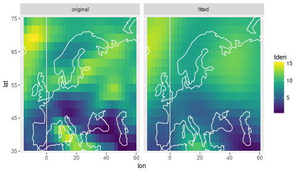
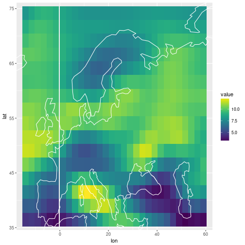

# Strom track density


```r
suppressPackageStartupMessages(library(tidyverse))
suppressPackageStartupMessages(library(INLA))
library(viridis)
```

```
## Loading required package: viridisLite
```

```r
library(rnaturalearth)
library(stringr)
knitr::opts_chunk$set(
  cache.path='_knitr_cache/storm-tracks/',
  fig.path='figure/storm-tracks/'
)
```


To plot maps, we use coastlines from the `rnaturalearth` data set:


```r
coast = ne_coastline(scale=110) %>% fortify %>% as_data_frame
```

The data we are looking at are spatial fields of storm track density (number of storms that pass through an area).
We have data from 4 climate models that have simulated past and future climate.
We also have historical observation data.
The area we are looking at is (roughly) Europe and the season is winter (DJF).


```r
load('data/storm-track-density.Rdata')
storms
```

```
## # A tibble: 4,320 x 5
##         lat        lon   model experiment     tden
##       <dbl>      <dbl>  <fctr>     <fctr>    <dbl>
##  1 36.47029 -14.161041 model_1 historical 4.460165
##  2 36.47029 -11.645844 model_1 historical 4.388444
##  3 36.47029  -9.130646 model_1 historical 4.148048
##  4 36.47029  -6.615448 model_1 historical 3.544464
##  5 36.47029  -4.100250 model_1 historical 3.052784
##  6 36.47029  -1.585052 model_1 historical 2.820646
##  7 36.47029   1.257596 model_1 historical 3.032609
##  8 36.47029   3.772789 model_1 historical 3.530901
##  9 36.47029   6.287981 model_1 historical 4.269177
## 10 36.47029   8.803174 model_1 historical 5.247809
## # ... with 4,310 more rows
```


```r
summary(storms)
```

```
##       lat             lon              model          experiment  
##  Min.   :36.47   Min.   :-14.161   model_1:960   historical:2400  
##  1st Qu.:45.90   1st Qu.:  3.773   model_2:960   future    :1920  
##  Median :55.33   Median : 22.637   model_3:960                    
##  Mean   :55.33   Mean   : 22.571   model_4:960                    
##  3rd Qu.:64.77   3rd Qu.: 41.501   obs    :480                    
##  Max.   :74.20   Max.   : 59.107                                  
##       tden        
##  Min.   : 0.2943  
##  1st Qu.: 6.9245  
##  Median : 8.9311  
##  Mean   : 8.6013  
##  3rd Qu.:10.5322  
##  Max.   :19.6039
```


```r
ggplot(data=storms) + 
  geom_tile(mapping=aes(x=lon, y=lat, fill=tden)) + 
  facet_grid(model ~ experiment) + 
  scale_fill_viridis() + 
  coord_cartesian(xlim = range(storms$lon), ylim=range(storms$lat)) +
  geom_path(data=coast, aes(x=long, y=lat, group=group), col='white') +
  labs(fill = 'storm\ntrack\ndensity')
```


The ultimate goal is to use all the model data and the observations to fill in the blank field for the future observations, calculating both a best guess estimate as well as uncertainty information.


## Smoothing a spatial field with R-INLA

As a preliminary, we will use R-INLA decompose a single spatial field into a smooth field represented by a 2-dimensional random walk, and a random component represented by independent Gaussian noise.

The 2d random walk is a generalisation of the 1d random walk, where the value $x_{i,j}$ at the gridpoint $(i,j)$ is given by the average of its nearest neighbours plus independent Normal noise with zero mean and precision $\tau$, i.e.

\begin{equation}
(x_{i+1,j} + x_{i-1,j} + x_{i,j+1} + x_{x,j-1}) - 4x_{i,j} \sim N(0, \tau^{-1})
\end{equation}

The precision parameter $\tau$ acts as a smoothness parameter.
The higher $\tau$, the less will $x_{i,j}$ differ from the average over its neighbors, and thus the smoother will be the 2d field. 

In R-INLA, the [2d random walk model](http://www.math.ntnu.no/inla/r-inla.org/doc/latent/rw2d-model.pdf) is specified as follows:


```r
nlon = select(storms, lon) %>% unique %>% nrow
nlat = select(storms, lat) %>% unique %>% nrow

inla_formula = tden ~ 1 + 
  f(point, model='rw2d', nrow=nlat, ncol=nlon)
```

The 2d random walk model in INLA only applies to data on a rectangular grid.
The 2d field must be saved as a vector in which the columns of the matrix are stacked on top of each other.
Our data frame `storms` has track density already in this format, since longitudes change fastest and latitudes change slowest as you go down the data frame.
So it is straightforward to create the INLA data frame.
We will only work with the field of historical observations for now.


```r
inla_data = storms %>%
  filter(experiment == 'historical', model == 'obs') %>%
  select(lon, lat, tden) %>%
  mutate(point = 1:(nlon*nlat))
```

We run INLA with the option `control.predictor=list(compute=TRUE)` because we want to extract fitted values later:


```r
inla_out = inla(formula=inla_formula, data=inla_data, 
                control.predictor=list(compute=TRUE, link=1))
```


```r
df = inla_data %>% 
  rename(original = tden) %>%
  mutate(fitted = inla_out$summary.fitted.values$mean) %>%
  gather(key='key', value='tden', original, fitted) %>%
  mutate(key = factor(key, levels=c('original', 'fitted')))

ggplot(data=df) + 
  geom_tile(mapping=aes(x=lon, y=lat, fill=tden)) + 
  facet_wrap(~ key) + 
  scale_fill_viridis() + 
  coord_cartesian(xlim = range(storms$lon), ylim=range(storms$lat)) +
  geom_path(data=coast, aes(x=long, y=lat, group=group), col='white') +
  labs(fill = 'storm\ntrack\ndensity')
```



The fitted values are smoother than the original.
It is possible to specify a fixed value for the precision parameter of the random walk to control the smoothness.
Here the precisions of the 2d random walk and the Gaussian residuals were both estimated by INLA; here are their posteriors:


```r
df = inla_out$marginals.hyperpar %>% map(as_data_frame) %>% bind_rows(.id='parameter')
ggplot(data=df, aes(x=x, y=y, color=parameter)) + geom_line() + coord_cartesian(xlim=c(0, 2.5))
```


## Decomposing spatial fields into common and individual components


```r
inla_formula = tden ~ -1 + 
  f(i_rw_common, model='rw2d', nrow=nlat, ncol=nlon) +
  f(i_bias, model='iid') +
  f(i_rw_indiv, model='rw2d', nrow=nlat, ncol=nlon, replicate=repl)
```
 

```r
n = nlon * nlat
m = storms %>% select(model) %>% unique %>% nrow
inla_data = storms %>% 
  filter(experiment == 'historical') %>%
  select(lon, lat, tden) %>%
  mutate(i_rw_common = rep(1:n, m)) %>%
  mutate(i_bias = rep(1:m, each=n)) %>%
  mutate(i_rw_indiv = rep(1:n, m)) %>%
  mutate(repl = rep(1:m, each=n))
```


```r
inla_out = inla(formula=inla_formula, data=inla_data)
```


```r
lonlat = inla_data %>% 
  filter(repl == 1) %>%
  select(lon, lat)
```

## The common mean


```r
df_common = 
  bind_cols(
    lonlat,
    inla_out$summary.random$i_rw_common %>% as_data_frame
  ) %>% 
  select(lon, lat, mean)
ggplot(data=df_common) + 
  geom_tile(mapping=aes(x=lon, y=lat, fill=mean)) + 
  scale_fill_viridis() + 
  coord_cartesian(xlim = range(storms$lon), ylim=range(storms$lat)) +
  geom_path(data=coast, aes(x=long, y=lat, group=group), col='white') +
  labs(fill = NULL)
```


## The individual biases


```r
df_bias = 
  inla_out$summary.random$i_bias %>% as_data_frame %>% 
  select(ID, mean) %>%    # extract ID and mean
  mutate(lon=0, lat=0) %>%
  rename(repl = ID) %>% mutate(repl = str_c('bias_', repl))
ggplot(data=df_bias) + 
  geom_tile(aes(x=lon, y=lat, width=180, height=180, fill=mean)) + 
  scale_fill_viridis() + 
  facet_wrap(~ repl, nrow=1) +
  coord_cartesian(xlim = range(storms$lon), ylim=range(storms$lat)) +
  geom_path(data=coast, aes(x=long, y=lat, group=group), col='white')
```

```
## Warning: Ignoring unknown aesthetics: width, height
```


## The individual residuals


```r
df_resid = 
  inla_out$summary.random$i_rw_indiv %>% as_data_frame %>% 
  select(ID, mean) %>%    # extract ID and mean
  group_by(ID) %>%        # create groups of 5 for each ID
  mutate(repl=str_c('resid_', 1:n())) %>%  # add replication index 1:size_of_group
  nest %>%                # put each group into a data frame
  bind_cols(lonlat) %>%   # bin lonlat data frame
  unnest(data)            # expand nested data frames again
ggplot(df_resid) + 
  geom_tile(aes(x=lon, y=lat, fill=mean)) + 
  scale_fill_viridis() + 
  facet_wrap(~ repl, nrow=1) +
  coord_cartesian(xlim=range(storms$lon), ylim=range(storms$lat)) +
  geom_path(data=coast, aes(x=long, y=lat, group=group), col='white')
```


# Combining past and future

Assumptions, partly based on belief about the physics, partly just to simplify the inference: 

- biases persist into the future
- future common mean does not depend on past common mean 
- all residuals are realisations of the same random process


```r
nlon = select(storms, lon) %>% unique %>% nrow
nlat = select(storms, lat) %>% unique %>% nrow
n = nlon * nlat
m = storms %>% select(model) %>% unique %>% nrow

inla_formula = tden ~ -1 +
  f(i_rw_common, model='rw2d', nrow=nlat, ncol=nlon, replicate=repl_rw_common) +
  f(i_bias, model='iid', replicate=repl_bias) +
  f(i_rw_indiv, model='rw2d', nrow=nlat, ncol=nlon, replicate=repl_rw_indiv)


inla_data = storms %>% 
  # add unobserved future observations as NAs
  bind_rows(
    storms %>% 
    filter(model == 'obs', experiment == 'historical') %>%
    mutate(experiment = factor('future', levels=levels(storms$experiment))) %>%
    mutate(tden = NA_real_)
  ) %>%
  # add common mean time and replication indices
  group_by(experiment, model) %>% mutate(i_rw_common = 1:n) %>% ungroup %>%
  mutate(repl_rw_common = as.integer(experiment)) %>%
  # add bias time and replication indices
  mutate(i_bias = 1) %>%
  group_by(model) %>% do(bind_cols(., repl_bias = as.integer(.$model))) %>% ungroup %>%
  # add residuals time and replication index
  group_by(experiment, model) %>% mutate(i_rw_indiv = 1:n) %>% ungroup %>%
  mutate(repl_rw_indiv = as.integer(as.factor(str_c(model, experiment))))
```


```r
  inla_out = inla(formula=inla_formula, data=inla_data, control.predictor=list(compute=TRUE, link=1))
```


## The posterior predictive standard deviation looks dubious


```r
inds = with(inla_data, which(experiment == 'future' & model == 'obs'))
pred_row_names = str_c('fitted.Predictor.', str_pad(inds, width=4, side='left', pad='0'))
df_pred = 
  inla_data %>% 
  filter(experiment == 'future', model == 'obs') %>%
  bind_cols(inla_out$summary.fitted.values[pred_row_names, ]) %>%
  select(lat, lon, mean, sd) %>%
  gather(key='posterior', value='value', mean, sd) 
ggplot(df_pred %>% filter(posterior == 'mean')) + 
  geom_tile(aes(x=lon, y=lat, fill=value)) + 
  scale_fill_viridis() + 
  coord_cartesian(xlim=range(storms$lon), ylim=range(storms$lat)) +
  geom_path(data=coast, aes(x=long, y=lat, group=group), col='white')
```



```r
ggplot(df_pred %>% filter(posterior == 'sd')) + 
  geom_tile(aes(x=lon, y=lat, fill=value)) + 
  scale_fill_viridis() + 
  coord_cartesian(xlim=range(storms$lon), ylim=range(storms$lat)) +
  geom_path(data=coast, aes(x=long, y=lat, group=group), col='white')
```


This looks like I mixed up lats and lons somewhere or something like this, but I haven't found a bug yet. 
Could this also be an artifact of the 2d random walk model? 
Will have to look into this more.


## Filling in the missing panel

The posterior predictive mean for the future observation above is on a different scale.
Below I produce the same plot as in the beginning, but with the "future obs" panel filled with the posterior predictive mean.


```r
df_ppmean_obs = 
  inla_data %>%
  filter(model == 'obs') %>%
  mutate(tden = ifelse(experiment == 'future', 
                       inla_out$summary.fitted.values[pred_row_names, 'mean'],
                       tden))
ggplot(df_ppmean_obs) + 
  geom_tile(aes(x=lon, y=lat, fill=tden)) + 
  facet_wrap( ~ experiment) + 
  scale_fill_viridis() + 
  coord_cartesian(xlim = range(storms$lon), ylim=range(storms$lat)) +
  geom_path(data=coast, aes(x=long, y=lat, group=group), col='white') +
  labs(fill = 'storm\ntrack\ndensity')
```


## Difference between historical observations and the posterior predictive mean


```r
df_diff = 
  df_ppmean_obs %>%
  select(lat, lon, experiment, tden) %>%
  spread(key=experiment, value=tden) %>%
  mutate(diff = historical - future)
ggplot(df_diff) + 
  geom_tile(aes(x=lon, y=lat, fill=diff)) + 
  scale_fill_viridis() + 
  coord_cartesian(xlim = range(storms$lon), ylim=range(storms$lat)) +
  geom_path(data=coast, aes(x=long, y=lat, group=group), col='white')
```


