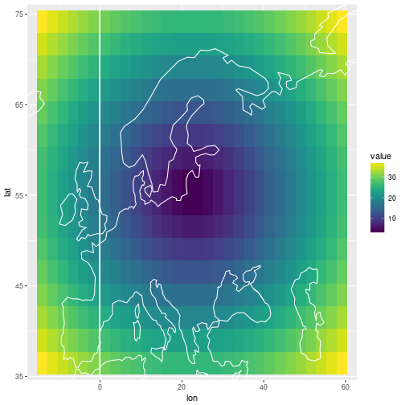
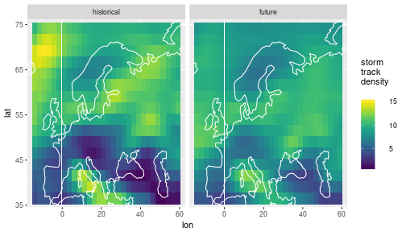
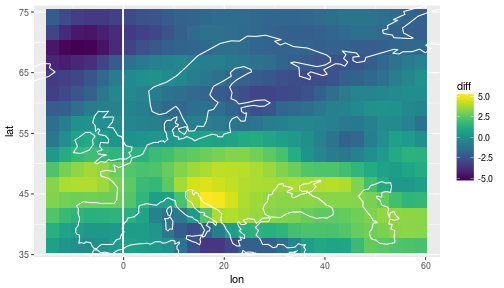

# Strom track density


## Libraries, preliminaries

I will use pipes, tibbles and other goodness from the `tidyverse`, coastline data from `rnaturalearth`, the `viridis` color scheme, and `INLA` for statistical inference:


```r
suppressPackageStartupMessages(library(tidyverse))
suppressPackageStartupMessages(library(stringr))
suppressPackageStartupMessages(library(viridis))
suppressPackageStartupMessages(library(INLA))
coast = rnaturalearth::ne_coastline(scale=110) %>% fortify %>% as_data_frame
```


## The data

The data we are looking at are spatial fields of storm track density (number of storms that pass through an area per season).
All the data is stored in a "tidy" data frame called `storms`, the track density variable is called `tden`:


```r
load('data/storm-track-density.Rdata')
storms %>% print(n=3)
```

```
## # A tibble: 4,320 x 5
##        lat       lon   model experiment      tden
##      <dbl>     <dbl>  <fctr>     <fctr>     <dbl>
## 1 36.47029 -14.16104 model_1 historical  4.460165
## 2 38.98548 -14.16104 model_1 historical  7.017774
## 3 41.50068 -14.16104 model_1 historical 10.581059
## # ... with 4,317 more rows
```

We have data from 4 climate models that have simulated past and future storms.
We also have historical observation data.
The area we are looking at is (roughly) Europe and the season is winter (DJF).
The data looks like this:


```r
ggplot(data=storms) + 
  geom_tile(mapping=aes(x=lon, y=lat, fill=tden)) + 
  facet_grid(model ~ experiment) + 
  scale_fill_viridis() + 
  coord_cartesian(xlim = range(storms$lon), ylim=range(storms$lat)) +
  geom_path(data=coast, aes(x=long, y=lat, group=group), col='white')
```


## The problem

Changes in storm activity over Europe under climate change is obviously of interest to a range of stakeholders, policy-makers, and the public in general.
So we want to use all the above data to say something about the expected future storm track density over the region of interest, as well as the associated uncertainty.


We don't expect future climate to be much different from past climate, so the historical observations will certainly be informative about future climate.
The climate model output includes much of our physical understanding about the climate system, as well as a likely scenario about future greenhouse gas emissions, which have an impact on the physical boundary conditions that drive the climate system.
So we will want to consider climate model output as well.
The existence of multiple climate models from different research centers, and the fact that they don't agree on future climate tells something about the imperfections in the models, which we will want to account for.

Our goal is to use all the model data and the observations in a coherent statistical framework to fill in the blank field in the plot above, the one for the future observations, calculating both a best guess estimate as well as the associated uncertainty.

This will involve a fair bit of spatial statistical modelling, for which we will use the R package `INLA` (the name R-INLA is also used), which implements the Integrated Nested Laplace Approximation methodology.


## Smoothing a spatial field with R-INLA

As a preliminary, we will use R-INLA to decompose a single spatial field into a smooth and a random component.
Here we will model the spatial correlation of the smooth component by a 2-dimensional random walk, and the random component by independent Gaussian noise.

The 2d random walk is a generalisation of the 1d random walk, where the value $x_{i,j}$ at the gridpoint $(i,j)$ is given by a weighted average of its nearest neighbours plus independent Normal noise with zero mean and precision $\tau$, i.e.

\begin{equation}
(x_{i+1,j} + x_{i-1,j} + x_{i,j+1} + x_{x,j-1}) - 4x_{i,j} \sim N(0, \tau^{-1})
\end{equation}

The precision parameter $\tau$ acts as a smoothness parameter.
The higher $\tau$, the less will $x_{i,j}$ differ from the average over its neighbors, and thus the smoother will be the 2d field. 

In R-INLA, the [2d random walk model](http://www.math.ntnu.no/inla/r-inla.org/doc/latent/rw2d-model.pdf) is paramtrised differently, using not only 4, but 12 nearest neighbors, with positive and negative weights. 
To fix the log-precision at a value of 1 the `rw2d` model is specified as follows:


```r
nlon = select(storms, lon) %>% unique %>% nrow
nlat = select(storms, lat) %>% unique %>% nrow
logtau = 1

inla_formula = tden ~ 1 +
  f(point, model='rw2d', nrow=nlat, ncol=nlon, 
    hyper=list(theta=list(initial=logtau, fixed=TRUE)))
```

The 2d random walk model in INLA only applies to data on a rectangular grid.
The 2d field must be saved as a vector in which the columns of the matrix are stacked on top of each other.
Our data frame `storms` has track density already in this format, since longitudes change fastest and latitudes change slowest as you go down the data frame.
So it is straightforward to create the INLA data frame.
We will only work with the field of historical observations for now.


```r
inla_data = storms %>%
  filter(experiment == 'historical', model == 'obs') %>%
  select(lon, lat, tden) %>%
  mutate(point = 1:(nlon*nlat))
```

We run INLA with the option `control.predictor=list(compute=TRUE)` because we want to extract fitted values later:


```r
inla_out = inla(formula=inla_formula, data=inla_data, 
                control.predictor=list(compute=TRUE, link=1))
```


```r
df = inla_data %>% 
  rename(original = tden) %>%
  mutate(fitted = inla_out$summary.fitted.values$mean) %>%
  gather(key='key', value='tden', original, fitted) %>%
  mutate(key = factor(key, levels=c('original', 'fitted')))

ggplot(data=df) + 
  geom_tile(mapping=aes(x=lon, y=lat, fill=tden)) + 
  facet_wrap(~ key) + 
  scale_fill_viridis() + 
  coord_cartesian(xlim = range(storms$lon), ylim=range(storms$lat)) +
  geom_path(data=coast, aes(x=long, y=lat, group=group), col='white')
```


The fitted values are smoother than the original.
If we change the precision value of the random walk, we can play with the smoothness:


```r
rw_df = inla_data %>% 
  select(lon, lat, tden) %>%
  mutate(smooth = 'original')

for (logtau in c(0.5,1,3)) {

  inla_formula = tden ~ 1 +
    f(point, model='rw2d', nrow=nlat, ncol=nlon, 
      hyper=list(theta=list(initial=logtau, fixed=TRUE)))

  inla_out = inla(formula=inla_formula, data=inla_data, 
                  control.predictor=list(compute=TRUE, link=1))

  out_df = inla_data %>% select(lon, lat) %>% 
    mutate(tden = inla_out$summary.fitted.values$mean) %>%
    mutate(smooth = str_c('logtau=', logtau))

  rw_df = bind_rows(rw_df, out_df)

}
```


```r
ggplot(data=rw_df) + 
  geom_tile(mapping=aes(x=lon, y=lat, fill=tden)) + 
  facet_wrap(~ smooth, nrow=1) + 
  scale_fill_viridis() + 
  coord_cartesian(xlim = range(storms$lon), ylim=range(storms$lat)) +
  geom_path(data=coast, aes(x=long, y=lat, group=group), col='white')
```


## Decomposing spatial fields into common and individual components


```r
inla_formula = tden ~ -1 + 
  f(i_rw_common, model='rw2d', nrow=nlat, ncol=nlon) +
  f(i_bias, model='iid') +
  f(i_rw_indiv, model='rw2d', nrow=nlat, ncol=nlon, replicate=repl)
```
 

```r
n = nlon * nlat
m = storms %>% select(model) %>% unique %>% nrow
inla_data = storms %>% 
  filter(experiment == 'historical') %>%
  select(lon, lat, tden) %>%
  mutate(i_rw_common = rep(1:n, m)) %>%
  mutate(i_bias = rep(1:m, each=n)) %>%
  mutate(i_rw_indiv = rep(1:n, m)) %>%
  mutate(repl = rep(1:m, each=n))
```


```r
inla_out = inla(formula=inla_formula, data=inla_data)
```


```r
lonlat = inla_data %>% 
  filter(repl == 1) %>%
  select(lon, lat)
```

## The common mean


```r
df_common = 
  bind_cols(
    lonlat,
    inla_out$summary.random$i_rw_common %>% as_data_frame
  ) %>% 
  select(lon, lat, mean)
ggplot(data=df_common) + 
  geom_tile(mapping=aes(x=lon, y=lat, fill=mean)) + 
  scale_fill_viridis() + 
  coord_cartesian(xlim = range(storms$lon), ylim=range(storms$lat)) +
  geom_path(data=coast, aes(x=long, y=lat, group=group), col='white') +
  labs(fill = NULL)
```


## The individual biases


```r
df_bias = 
  inla_out$summary.random$i_bias %>% as_data_frame %>% 
  select(ID, mean) %>%    # extract ID and mean
  mutate(lon=0, lat=0) %>%
  rename(repl = ID) %>% mutate(repl = str_c('bias_', repl))
ggplot(data=df_bias) + 
  geom_tile(aes(x=lon, y=lat, width=180, height=180, fill=mean)) + 
  scale_fill_viridis() + 
  facet_wrap(~ repl, nrow=1) +
  coord_cartesian(xlim = range(storms$lon), ylim=range(storms$lat)) +
  geom_path(data=coast, aes(x=long, y=lat, group=group), col='white')
```

```
## Warning: Ignoring unknown aesthetics: width, height
```


The posterior standard deviation on all the bias terms is very small, order of 0.001.

## The individual residuals


```r
df_resid = 
  inla_out$summary.random$i_rw_indiv %>% as_data_frame %>% 
  select(ID, mean) %>%    # extract ID and mean
  group_by(ID) %>%        # create groups of 5 for each ID
  mutate(repl=str_c('resid_', 1:n())) %>%  # add replication index 1:size_of_group
  nest %>%                # put each group into a data frame
  bind_cols(lonlat) %>%   # bin lonlat data frame
  unnest(data)            # expand nested data frames again
ggplot(df_resid) + 
  geom_tile(aes(x=lon, y=lat, fill=mean)) + 
  scale_fill_viridis() + 
  facet_wrap(~ repl, nrow=1) +
  coord_cartesian(xlim=range(storms$lon), ylim=range(storms$lat)) +
  geom_path(data=coast, aes(x=long, y=lat, group=group), col='white')
```


# Combining past and future

Assumptions, partly based on belief about the physics, partly just to simplify the inference: 

- biases persist into the future
- future common mean does not depend on past common mean 
- all residuals are realisations of the same random process


```r
nlon = select(storms, lon) %>% unique %>% nrow
nlat = select(storms, lat) %>% unique %>% nrow
n = nlon * nlat
m = storms %>% select(model) %>% unique %>% nrow

inla_formula = tden ~ -1 +
  f(i_rw_common, model='rw2d', nrow=nlat, ncol=nlon, replicate=repl_rw_common) +
  f(i_bias, model='iid', replicate=repl_bias) +
  f(i_rw_indiv, model='rw2d', nrow=nlat, ncol=nlon, replicate=repl_rw_indiv)


inla_data = storms %>% 
  # add unobserved future observations as NAs
  bind_rows(
    storms %>% 
    filter(model == 'obs', experiment == 'historical') %>%
    mutate(experiment = factor('future', levels=levels(storms$experiment))) %>%
    mutate(tden = NA_real_)
  ) %>%
  # add common mean time and replication indices
  group_by(experiment, model) %>% mutate(i_rw_common = 1:n) %>% ungroup %>%
  mutate(repl_rw_common = as.integer(experiment)) %>%
  # add bias time and replication indices
  mutate(i_bias = 1) %>%
  group_by(model) %>% do(bind_cols(., repl_bias = as.integer(.$model))) %>% ungroup %>%
  # add residuals time and replication index
  group_by(experiment, model) %>% mutate(i_rw_indiv = 1:n) %>% ungroup %>%
  mutate(repl_rw_indiv = as.integer(as.factor(str_c(model, experiment))))
```


```r
  inla_out = inla(formula=inla_formula, data=inla_data, control.predictor=list(compute=TRUE, link=1))
```


```r
inds = with(inla_data, which(experiment == 'future' & model == 'obs'))
pred_row_names = str_c('fitted.Predictor.', str_pad(inds, width=4, side='left', pad='0'))
df_pred = 
  inla_data %>% 
  filter(experiment == 'future', model == 'obs') %>%
  bind_cols(inla_out$summary.fitted.values[pred_row_names, ]) %>%
  select(lat, lon, mean, sd) %>%
  gather(key='posterior', value='value', mean, sd) 
ggplot(df_pred %>% filter(posterior == 'mean')) + 
  geom_tile(aes(x=lon, y=lat, fill=value)) + 
  scale_fill_viridis() + 
  coord_cartesian(xlim=range(storms$lon), ylim=range(storms$lat)) +
  geom_path(data=coast, aes(x=long, y=lat, group=group), col='white')
```


```r
ggplot(df_pred %>% filter(posterior == 'sd')) + 
  geom_tile(aes(x=lon, y=lat, fill=value)) + 
  scale_fill_viridis() + 
  coord_cartesian(xlim=range(storms$lon), ylim=range(storms$lat)) +
  geom_path(data=coast, aes(x=long, y=lat, group=group), col='white')
```




## Filling in the missing panel

The posterior predictive mean for the future observation above is on a different scale.
Below I produce the same plot as in the beginning, but with the "future obs" panel filled with the posterior predictive mean.


```r
df_ppmean_obs = 
  inla_data %>%
  filter(model == 'obs') %>%
  mutate(tden = ifelse(experiment == 'future', 
                       inla_out$summary.fitted.values[pred_row_names, 'mean'],
                       tden))
ggplot(df_ppmean_obs) + 
  geom_tile(aes(x=lon, y=lat, fill=tden)) + 
  facet_wrap( ~ experiment) + 
  scale_fill_viridis() + 
  coord_cartesian(xlim = range(storms$lon), ylim=range(storms$lat)) +
  geom_path(data=coast, aes(x=long, y=lat, group=group), col='white') +
  labs(fill = 'storm\ntrack\ndensity')
```




## Difference between the posterior predictive mean and the historical observations


```r
df_diff = 
  df_ppmean_obs %>%
  select(lat, lon, experiment, tden) %>%
  spread(key=experiment, value=tden) %>%
  mutate(diff = future - historical)
ggplot(df_diff) + 
  geom_tile(aes(x=lon, y=lat, fill=diff)) + 
  scale_fill_viridis() + 
  coord_cartesian(xlim = range(storms$lon), ylim=range(storms$lat)) +
  geom_path(data=coast, aes(x=long, y=lat, group=group), col='white')
```




